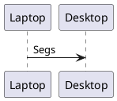

# About
If you have ever used `rust` before, you know of its long compile times and how demanding the process is. This is not a big deal with tiny projects, but it starts to show its presence in small projects already.

`rdev` is a tool to ease remote development. It's creation was motivated by a specific problem faced by me: I need to build software but I have a weak laptop for day-to-day use. However, I also own a beafy desktop computer that I don't use much.

